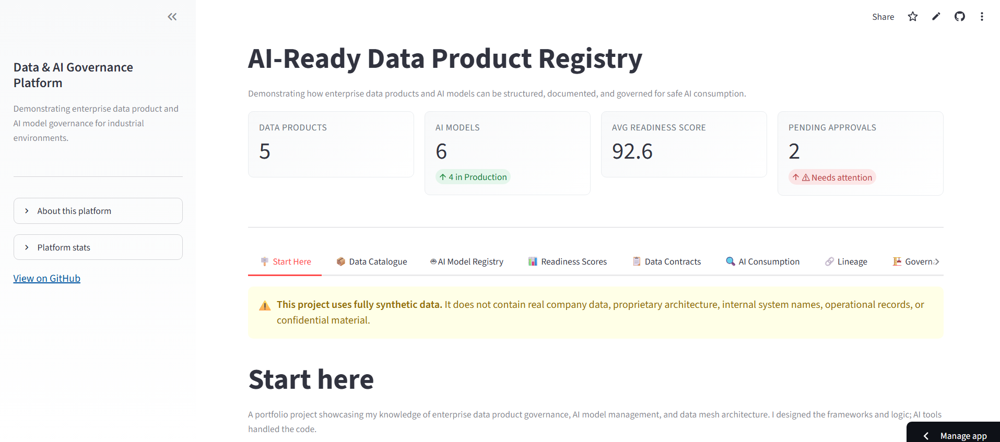

# AI-Ready Data Product Registry & Governance Platform

A portfolio project demonstrating how enterprise data products and AI models can be structured, documented and governed so they are safe for analytics and AI-agent consumption in industrial environments.

Live demo - [AI-ready data product registry](https://mayowa-togun-ai-data-pdmgt-technical-portfolio-app.streamlit.app/)

## Preview



## Why I built this
I built this project to make my data product, AI governance and enterprise architecture thinking visible outside my day-to-day work. As a product leader in a regulated industrial environment, much of my contribution sits in decisions, processes, governance structures, stakeholder alignment and product trade-offs that are difficult to show in a traditional GitHub repository.
This application demonstrates how I think about the foundation layer required for AI at scale: governed data products, clear ownership, data contracts, lineage, quality expectations, AI usage policies, model risk controls and human-in-the-loop approval workflows.

The examples are inspired by my experience working across procurement, offshore logistics and contract management in an industrial energy context. All data, scenarios, structures and users in this project are fully synthetic and fictional. The project does not contain real company data, proprietary architecture, internal system names, operational records or confidential material.

## What this demonstrates
This project shows how an enterprise could connect data product governance and AI model governance in one operating view. Many organisations have data catalogues, and many have AI/ML platforms, but the relationship between them is often implicit. This prototype makes that relationship explicit:
  Which AI model or agent is allowed to consume which data product, under what conditions, with which quality requirements, autonomy limits and escalation rules?

The platform includes:
- A data product catalogue with ownership, metadata, quality rules, lineage and usage information
- An AI model registry with evaluations, OKRs, risk classification, autonomy levels and data dependencies
- AI-readiness scoring across eight governance dimensions
- Data contract validation for analytics and AI-agent consumption
- AI consumption rules showing permitted uses, prohibited uses and human-review triggers
- Data mesh architecture and process maps for industrial workflows
- Governance workflows for users, API keys and approvals

## My contribution
I designed the product concept, PRD, governance model, domain logic, data product structures, AI-readiness scoring framework, contract validation rules, information architecture and documentation.

I used AI-assisted development tools to accelerate implementation, but the product framing, governance logic, domain model, acceptance criteria, synthetic scenario design and final integration decisions are my own.

## How it was built
- Python and Streamlit for the application
- Pydantic v2 for data models and validation
- Faker for synthetic data generation
- Mermaid for lineage and architecture diagrams
- Warp as the AI-assisted development environment
- AI coding assistants/agents for implementation acceleration and iteration support

## Repository documents
- PRD.md — product requirements, personas, user stories, functional requirements and acceptance criteria
- technical-architecture-document.md — architecture, data flow and implementation notes
- prompt-engineering-build-log.md — build process, prompt iterations and development decisions


## Run locally

```bash
git clone https://github.com/TMayowa/ai-ready-data-product-registry.git
cd ai-ready-data-product-registry
pip install -r requirements.txt
python generate_data.py
python generate_ai_models.py
python generate_users.py
python -m streamlit run app.py
```

## Project structure

```
ai-ready-data-product-registry/
├── app.py                      # Streamlit application (8 tabs)
├── generate_data.py            # Synthetic data product generator
├── generate_ai_models.py       # Synthetic AI model generator
├── generate_users.py           # Synthetic users, API keys, approvals
├── requirements.txt
├── data/
│   ├── data_products.json        (5 products, realistic imperfections)
│   ├── ai_models.json            (6 models, mixed statuses)
│   ├── users.json                (10 users, mixed roles)
│   ├── api_keys.json             (8 keys, mixed statuses)
│   └── approval_requests.json    (6 requests, mixed statuses)
├── src/
│   ├── models.py                 # All Pydantic models
│   ├── readiness_score.py        # AI-readiness scoring engine
│   ├── contract_validator.py     # Data contract validation
│   ├── lineage.py                # Mermaid lineage generator
│   ├── data_mesh.py              # Data mesh architecture and principles
│   └── process_maps.py           # Business process flow maps
└── screenshots/
```

## Data mesh architecture

This platform models a data mesh with 5 domains:

| Domain | Data Products | AI Models | Maturity |
|--------|--------------|-----------|----------|
| Procurement | Supplier Performance Summary | Supplier Risk Agent, Procurement Anomaly Detector | Measured |
| Contract Management | Contract Spend History | Contract Insights Assistant | Managed |
| Offshore Logistics | Logistics Delay Events | Logistics Disruption Agent | Managed |
| Materials Management | Inventory Availability Snapshot | Inventory Planning Assistant | Managed |
| Operations | Maintenance Work Order History | Maintenance Planning Agent | Measured |

## Sample data products

| Product | Domain | Classification | AI autonomy level | Gov Status |
|---------|--------|---------------|-------------------|------------|
| Supplier Performance Summary | Procurement | Internal | Recommend | Approved |
| Contract Spend History | Contract Management | Confidential | Read-only | Under review |
| Logistics Delay Events | Offshore Logistics | Internal | Recommend | Approved |
| Inventory Availability Snapshot | Materials Management | Internal | Recommend | Draft |
| Maintenance Work Order History | Operations | Restricted | Read-only | Approved |


## Disclaimer

This project uses fully synthetic data generated for portfolio and demonstration purposes. It does not contain real company data, proprietary architecture, internal system names, operational records, supplier information, or confidential material. Data product and AI model structures are inspired by industrial energy-sector patterns but are entirely fictional.

---
Built by Mayowa Togun | [GitHub](https://github.com/TMayowa)
